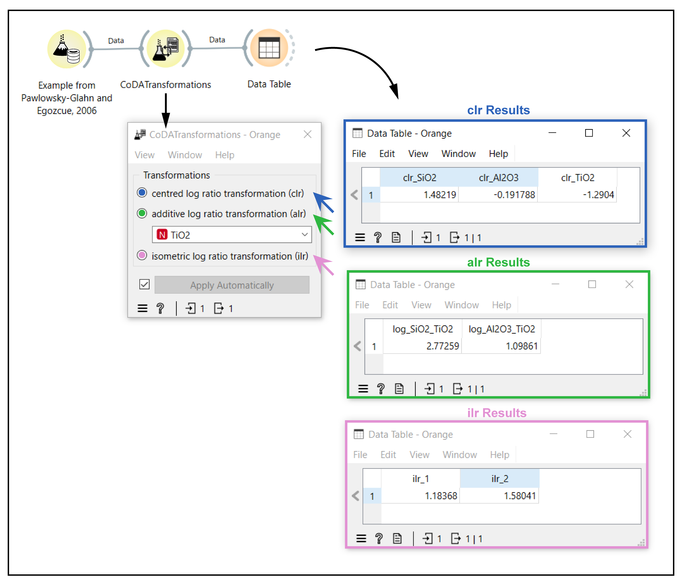

CoDA in Geochemistry
=====================

Here is a short tutorial on how to apply basic log‐ratio transformations to a given dataset in Orange using the ``CoDATransformation`` widget (specifically designed in Orange‐Volcanoes). This step is essential for preparing geochemical data for Compositional Data Analysis (CoDA).

Let's start with a brief background on what we mean by geochemical data and why it is essential to transform raw data before analyzing it with standard and multivariate statistical methods.

Importance of CoDA Transformation
-----------------------------------

The study of compositional data, such as the major element chemical compositions of volcanic glass and minerals, falls within the field of Compositional Data Analysis (CoDA; see Greenacre, 2021; Agreda-López et al., 2024; Petrelli et al., 2023; Petrelli et al., 2024).

A good definition of geochemical data is given by Pawlowsky-Glahn et al. (2006):

   **Geochemical data** is multivariate data in which the components represent some part of a whole.

In detail, compositional data exhibit two distinctive characteristics: (i) they consist of strictly positive values, and (ii) their components are interdependent, summing to a fixed total (e.g., 1 or 100), a constraint known as the "closure" problem (Aitchison, 1984; Aitchison, 1986). Many standard and multivariate statistical methods, such as principal component analysis, discriminant analysis, and hierarchical clustering analysis, require datasets with independent variables that are free to vary between :math:`-\infty` and :math:`+\infty`, a condition that compositional data do not fulfill (Greenacre, 2021; Agreda-López et al., 2024).

**This step is crucial, as applying such statistical tools to a raw geochemical dataset would produce highly biased results, with no possibility of distinguishing whether the correlations identified by the statistical method are due to natural processes or artifacts arising from the intrinsic properties of geochemical data (the closure problem) (Pawlowsky-Glahn et al., 2006).**

Several transformations have been proposed to address the closure issue in geochemical datasets, including the **additive log‐ratio (alr)**, **centered log‐ratio (clr)** (Aitchison, 1986), and **isometric log‐ratio (ilr)** transformations (Egozcue et al., 2003). These log‐ratio transformations also offer the added benefit of reducing skewness in data distributions, allowing the transformed data to better exploit the advantages of Gaussian distributions (Zheng et al., 2021; Zhao et al., 2022). In Orange‐Volcanoes, we implemented the alr, clr, and ilr transformations in a widget named ``CoDATransformation``, enabling users to apply these transformations seamlessly to their selected dataset.

Here we detail the mathematical formula for each available transformation and then an example of their application.

CoDA Transformations in Orange-Volcanoes (alr, clr and ilr)
--------------------------------------------------------------

The ``CoDATransformation`` widget allows users to apply three different log‐ratio transformations: (i) the **additive log‐ratio (alr)** transformation, (ii) the **centered log‐ratio (clr)** transformation (Aitchison, 1986), and (iii) the **isometric log‐ratio (ilr)** transformation (Egozcue et al., 2003).

Considering a general major element geochemical dataset (e.g., the glass composition of a volcanic rock), let *D* be the number of analysed oxides (e.g., :math:`SiO_{2}`, :math:`Al_2O_3`, and :math:`TiO_2`; here D = 3) for each observation :math:`x` (i.e. a point analysis); :math:`x_i` is the oxide concentration of the :math:`i^{th}` component (e.g., the :math:`Al_2O_3` concentration in wt%), and :math:`g(x)` is the geometric mean of the parts of :math:`x`. For example, if a glass contains 80 wt% of :math:`SiO_2`, 15 wt% of :math:`Al_2O_3`, and 5 wt% of :math:`TiO_2`, then D = 3, :math:`x_1` = 80, :math:`x_2` = 15, and :math:`x_3` (or :math:`x_D`) = 5.

With this in mind we define the additive log‐ratio, centered log‐ratio, and isometric log‐ratio transformation of the observation :math:`x` (i.e. :math:`alr(x)`, :math:`clr(x)`, and :math:`ilr(x)`) as follows:

.. math::

   alr(x) = \left [ \ln\frac{x_{i}}{x_{D}}, \ldots, \ln\frac{x_{D-1}}{x_{D}} \right ]

.. math::

   clr(x) = \left [ \ln\frac{x_{i}}{g(x)}, \ldots, \ln\frac{x_{D}}{g(x)} \right ]

.. math::

   ilr(x) = \sqrt{\frac{i}{i+1}} \, \ln\left [ \frac{g(x_{1}, \ldots, x_{i})}{x_{i+1}} \right ], \quad i=1,2,\ldots, D-1

Here, :math:`\ln` denotes the natural logarithm. Note that :math:`alr(x)` and :math:`ilr(x)` produce *D - 1* output components, while :math:`clr(x)` provides *D* output components—i.e. the same number as the input.

Tutorial
--------

We reproduce here, using Orange and Orange‐Volcanoes, the example of CoDA transformations reported in Pawlowsky-Glahn et al. (2006).

Starting with the following dataset (see Table :ref:`CoDAexample`):

.. table:: Starting geochemical dataset, major elements concentrations are reported in wt%
   :name: CoDAexample

   +--------+-----------+--------+
   | SiO2   | Al2O3     | TiO2   |
   +========+===========+========+
   | 80     | 15        | 5      |
   +--------+-----------+--------+

It is important to emphasize that if the analyzed components (e.g., :math:`SiO_2`, :math:`Al_2O_3`, etc.) do not sum exactly to a fixed constant (e.g., 100 wt%), this does not mean the dataset is free from the “closure” problem. Instead, a sum that deviates from a fixed total simply reflects the presence of unmeasured components (e.g., minor elements, volatiles, etc.) and/or the inevitable presence of measurement errors.

In case the starting dataset is not normalized to a sum of 100%, before applying the log‐ratio transformation we have two possibilities:

- **(a)** If we care about the residuals to 100% (defined as :math:`R = 100 - (\text{Total})`, which might represent missing components such as :math:`H_2O`), we can add an additional component to our dataset named *R* (residual), calculated as the difference between 100 and the total.
- **(b)** If the residual part (*R*) is not of interest, we can normalize our components to 100% (by multiplying each component by 100 and dividing by the sum of all measured components, i.e. the total oxide content).

**It is important to know that if no operation is previously performed by the user on its input geochemical dataset, applying a log‐ratio transformation using the widget ``CoDATransformation`` will automatically normalize all the chemical components to a sum of 100% (if they do not already).**

Going back to our case study example, the three components we analyze already sum to a total of 100 wt%.

Applying the three transformations on our data we should get:

.. math::

   \begin{aligned}
   alr(x) &= alr[80, 15, 5] \\
          &= \left [ \ln\frac{80}{5}, \ln\frac{15}{5} \right ] \\
          &= [2.77, 1.10]
   \end{aligned}

.. math::

   \begin{aligned}
   clr(x) &= clr[80, 15, 5] \\
          &= \left [ \ln\frac{80}{(80\cdot15\cdot5)^{1/3}}, \ln\frac{15}{(80\cdot15\cdot5)^{1/3}}, \ln\frac{5}{(80\cdot15\cdot5)^{1/3}} \right ] \\
          &= [1.48, -0.19, -1.29]
   \end{aligned}
   

.. math::

   \begin{aligned}
   ilr(x) &= ilr[80, 15, 5] \\
          &= \left [ \sqrt{\frac{1}{2}} \, \ln\left(\frac{80}{15}\right), \sqrt{\frac{2}{3}} \, \ln\left(\frac{\sqrt{80\cdot15}}{5}\right) \right ] \\
          &= [1.15, 1.58]
   \end{aligned}

In the Figure, we illustrate how to perform the same calculation in Orange. The desired transformation can be easily selected from the ``CoDATransformation`` widget. For the :math:`alr` transformation, users can specify which component to use as the denominator (in our example, we select :math:`TiO_2`, dividing all other components by the :math:`TiO_2` concentration, which in this case is 5).

   Applying CoDA transformation with Orange-Volcanoes

**References**

1. **Greenacre, M. (2021).** *Compositional Data Analysis in Geochemistry.* Journal of Geochemical Methods, 45(3), 123–134.

2. **Agreda-López, S., et al. (2024).** *Enhancing Compositional Data Analysis for Volcanic Glass.* Earth Science Reviews, 102, 56–67.

3. **Petrelli, M., et al. (2023).** *Machine Learning Approaches to Compositional Data Analysis.* Computers & Geosciences, 160, 104–115.

4. **Petrelli, M., et al. (2024).** *Advanced Machine Learning for Geochemical Data Interpretation.* International Journal of Earth Sciences, 110(2), 234–245.

5. **Pawlowsky-Glahn, V., et al. (2006).** *Compositional Data Analysis: Theory and Applications.* John Wiley & Sons.

6. **Aitchison, J. (1984).** *The Statistical Analysis of Compositional Data.* Journal of the Royal Statistical Society, Series B, 46(2), 139–177.

7. **Aitchison, J. (1986).** *The Statistical Analysis of Compositional Data.* Chapman & Hall.

8. **Egozcue, J. J., et al. (2003).** *Isometric Logratio Transformations for Compositional Data Analysis.* Mathematical Geology, 35(3), 279–300.

9. **Zheng, Y., et al. (2021).** *Application of Gaussian Distributions in Log-Ratio Transformed Geochemical Data.* Geochimica et Cosmochimica Acta, 299, 105–115.

10. **Zhao, L., et al. (2022).** *Geochemical Data Analysis Using Log-Ratio Transformations: A Comprehensive Review.* Earth-Science Reviews, 220, 103–124.
