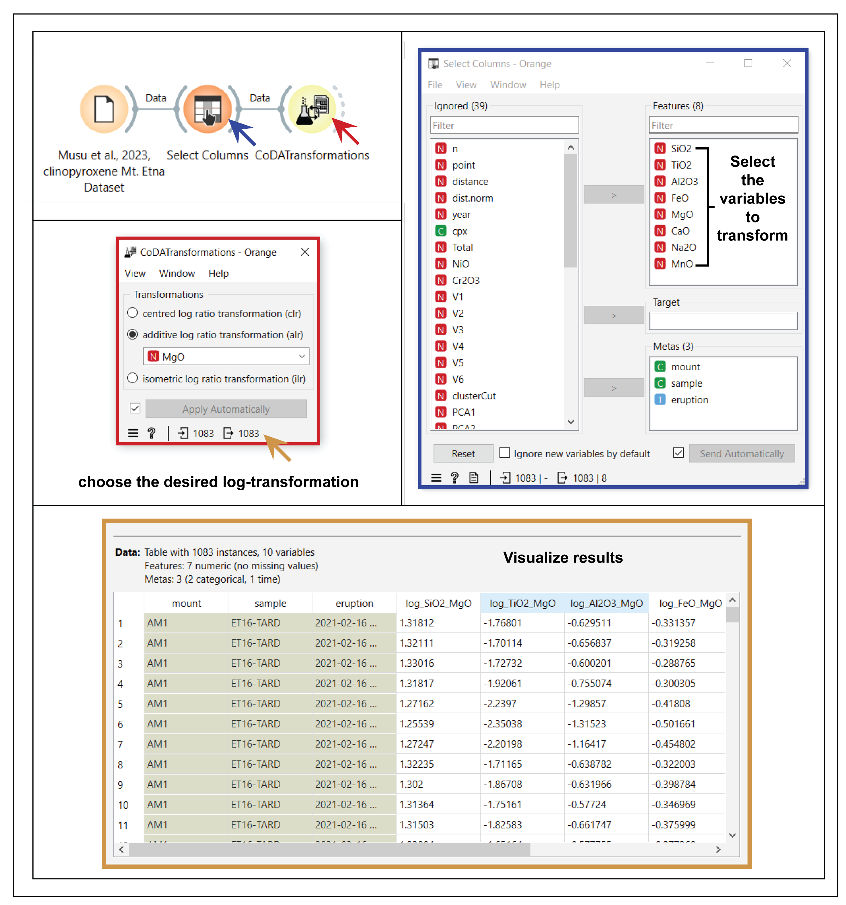

CoDA Transformation
===================

The use of the ``CoDATransformation`` widget, implemented in the Orange-Volcanoes add-on, enables users to conduct several multivariate analyses (e.g., hierarchical clustering, k-means, PCA, etc.) on geochemical, petrological, and volcanological data sets. As illustrated in the Figure, users can easily upload their desired data set into the Orange canvas using the widget ``File``. This allows users to directly import into Orange a pre-prepared datasheet (containing only the variables to be transformed) or a raw data set that includes additional columns, variables, and metadata beyond those targeted for transformation.

In the case of raw data sets, users can utilize the ``Select Columns`` widget (already built into base Orange) to specify the columns to process (i.e., transform with a log-ratio method). The ``Select Columns`` widget facilitates the selection of the variables that the user intends to use for the data transformation and the following analysis, excluding unnecessary columns and selecting specific columns as metadata to carry forward through the subsequent steps of the Orange workflow. Once the desired variables are selected, they can be linked to the ``CoDATransformation`` widget, which is specifically designed within Orange-Volcanoes for compositional data analysis.

As shown in the Figure, the widget allows choosing among three distinct isometric log-ratio transformations:

1. **Centered log-ratio (clr) transformation**
2. **Additive log-ratio (alr) transformation**
3. **Isometric log-ratio (ilr) transformation**

A simple drop-down menu allows the user to select which major oxide to use as the denominator for the alr transformation.

   **CoDA Transformation**. The CoDATransformation widget allows the user to transform the starting data set with three different log-ratio transformations: 1) centered log-ratio (clr); 2) additive log-ratio (alr); and 3) isometric log-ratio (ilr) transformations. Users can upload an already pre-prepared data set on the Orange canvas with the widget ``File`` or upload the raw data set (with the widget ``File``) and then select the desired columns to transform using the widget ``Select Columns``.

   The **CoDATransformations** widget allows users to transform a starting data set using three different log‐ratio transformations: 1) Centered log‐ratio (clr); 2)Additive log‐ratio (alr); 3) Isometric log‐ratio (ilr).
