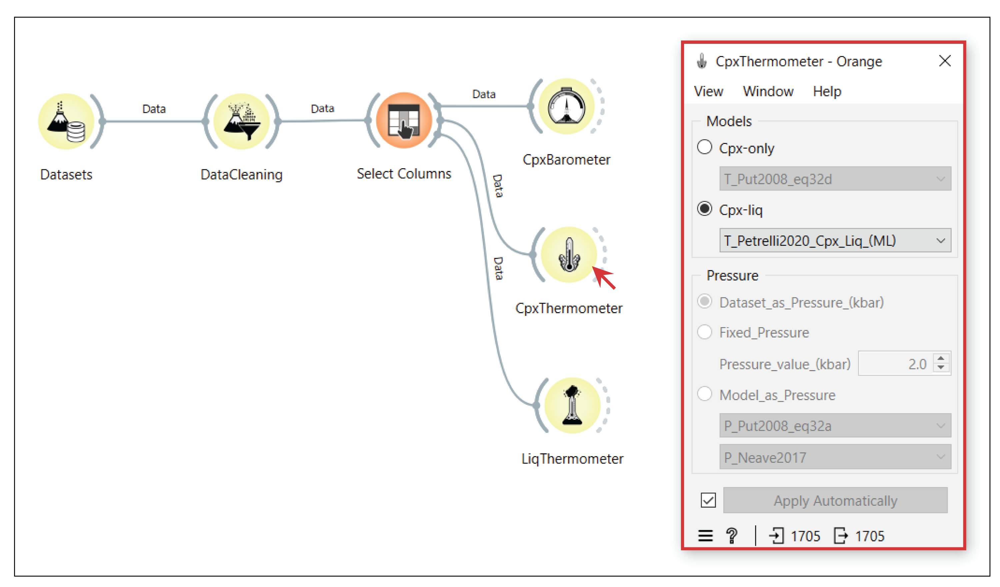

CpxThermometer
==============

This widget calculates the temperature of clinopyroxene formation using its chemical composition or the composition of clinopyroxene–liquid pairs.

The widget uses the `Thermobar <https://www.jvolcanica.org/ojs/index.php/volcanica/article/view/161>`_ tool to function and requires a dataset prepared in a specific way (with specific variable labels). An example of how variables should be renamed before using the widget is shown in Table 1. More details can be found by consulting the Thermobar `documentation <https://thermobar.readthedocs.io/en/latest/>`_.

As shown in the Figure, users can select whether to use a thermometer based on cpx composition only or on cpx–liquid pairs. For each of the two options, users can select the thermometer formula that best suits their dataset via a convenient drop-down menu. If the chosen formula is pressure-dependent, the user can choose whether to (i) use pressure values found in a specific column within their dataset, (ii) enter a specific pressure to apply to the entire dataset, or (iii) calculate their own pressure from a specific model.

   **CpxThermometer**. The CpxThermometer widget allows the user to calculate the temperature of clinopyroxene formation using its chemical composition or the composition of clinopyroxene–liquid pairs.

