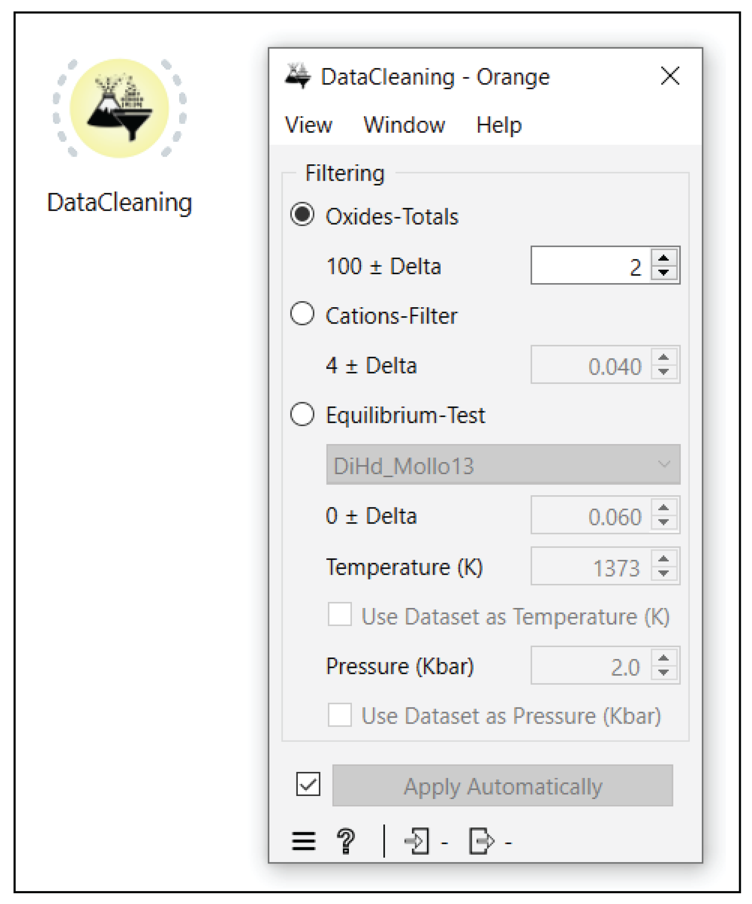

Data Cleaning
=============

The "Data Cleaning" widget, implemented in Orange Volcanoes, allows the user to filter out and clean, from the starting dataset, bad analytical points and observations out of equilibrium.

In detail, Data Cleaning implements three different types of filters:
 
1. **oxide wt% total filter**
2. **cation per formula unit filter**
3. **liquid-crystal pairs equilibrium filter**

The widget panel allows users to easily select the desired thresholds to be used within filters and the formula to use for the liquid-crystal pairs equilibrium test (Figure 4).

In the first Orange-Volcanoes release this function is available for clinopyroxene only.

In a subsequent update, we have implemented specialized functions based on Thermobar (see Wieser et al., 2022) that enable users to select the appropriate equilibrium test and specify the threshold for filtering their geochemical data.

All the above filtering techniques can be applied to crystal and melt data using the Data Cleaning widget. As shown in Figure :ref:`_fig_geochemical_data_filtering`, the Data Cleaning interface ...

.. _fig_geochemical_data_filtering:

   **Geochemical Data Filtering**. The Filtering widget allows the user to filter the starting data set for: 1. oxide wt% totals; 2. cation per formula unit sum; and 3. crystal-melt pair disequilibrium.
