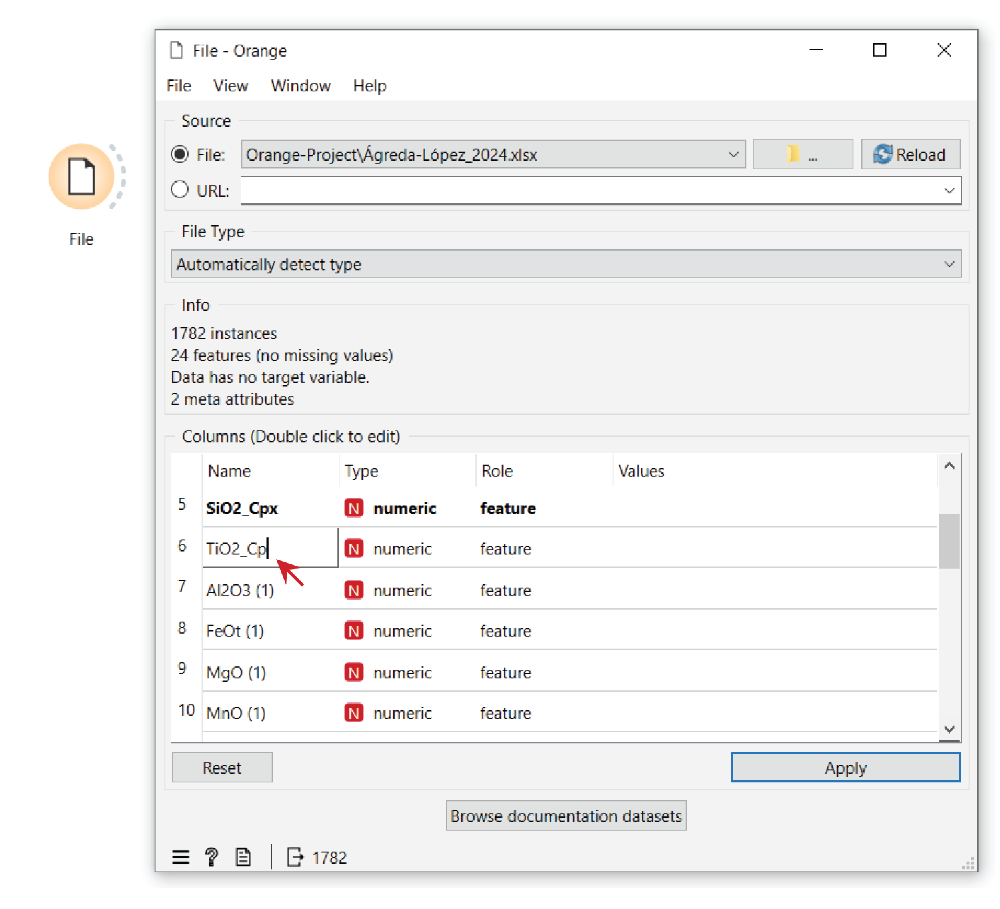

Importing Data
==============

Once Orange and Orange-Volcanoes are correctly installed on your PC, importing and analyzing your dataset is straightforward.

The initial Orange interface consists of a white workspace (Orange Canvas) and a list of available functions (Widgets) on the left.

To import data, double-click or drag the `‘File’ widget <https://orangedatamining.com/widget-catalog/data/file/>`_ (Figure 1) onto the canvas. This widget allows you to import any ``.xlsx``, ``.txt``, or ``.CSV`` file into the Orange environment.

Clicking the `‘File’ widget <https://orangedatamining.com/widget-catalog/data/file/>`_ lets you select and load files directly from your PC. After loading, you can rename individual variables within your dataset and adjust their types (e.g., text, numeric, etc.).

This step is essential for optimizing your dataset for thermobarometric analysis. Orange-Volcanoes widgets dedicated to thermobarometric estimates are based on `Thermobar <https://www.jvolcanica.org/ojs/index.php/volcanica/article/view/161>`_, which requires input files with specific characteristics (Figure 2; e.g., data type and column names). You can review the required format in the `Thermobar documentation <https://thermobar.readthedocs.io/en/latest/>`_.

Indeed, thermobarometric estimations are built on `Thermobar <https://www.jvolcanica.org/ojs/index.php/volcanica/article/view/161>`_
(Wieser et al., 2022). In addition to our paper and this documentation, you can consult the Thermobar
`paper <https://www.jvolcanica.org/ojs/index.php/volcanica/article/view/161>`_ and
`documentation <https://thermobar.readthedocs.io/en/latest/>`_ along with the specific paper related
to the used formula for thermobarometry. Make sure you cite them properly as well if you are using
Orange-Volcanoes for thermobarometric estimates.

Column names can be modified either in the source file before uploading to Orange or directly within Orange, through the `‘File’ widget <https://orangedatamining.com/widget-catalog/data/file/>`_. For instance, you can specify whether the data pertains to liquid chemistry ``_Liq`` or a specific mineral phase (e.g., Clinopyroxene; ``_Cpx``).

**References:**

Wieser, P., Petrelli, M., Lubbers, J., Wieser, E., Ozaydin, S., Kent, A. and Till, C. (2022) “Thermobar: An open-source Python3 tool for thermobarometry and hygrometry”, Volcanica, 5(2), pp. 349–384. doi: 10.30909/vol.05.02.349384.