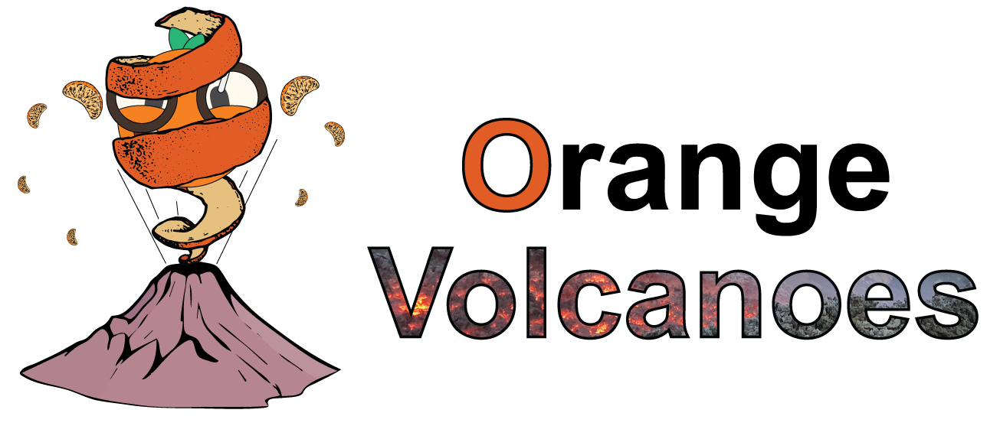

.. Orange3-Volcanoes documentation master file, created by
   sphinx-quickstart on Wed Dec  4 12:17:19 2024.
   You can adapt this file completely to your liking, but it should at least
   contain the root `toctree` directive.

Orange3-Volcanoes documentation
===============================
Orange-Volcanoes is an extension (add-on) of the open-source
`Orange data mining platform <https://orangedatamining.com/>`_, specifically designed to support
data-driven investigations in petrology and volcanology. 

|

Orange-Volcanoes
----------------

.. toctree::
   :maxdepth: 2

   introduction
   installing
   importing_data

Tutorials
---------

.. toctree::
   :maxdepth: 2

   coda_geochemistry
   tephra_clustering
   tephra_classification

Widgets
-------

.. toctree::
   :maxdepth: 2

   datasets
   data_cleaning
   coda_transformations
   cpx_barometer
   cpx_thermometer
   liq_thermometer

