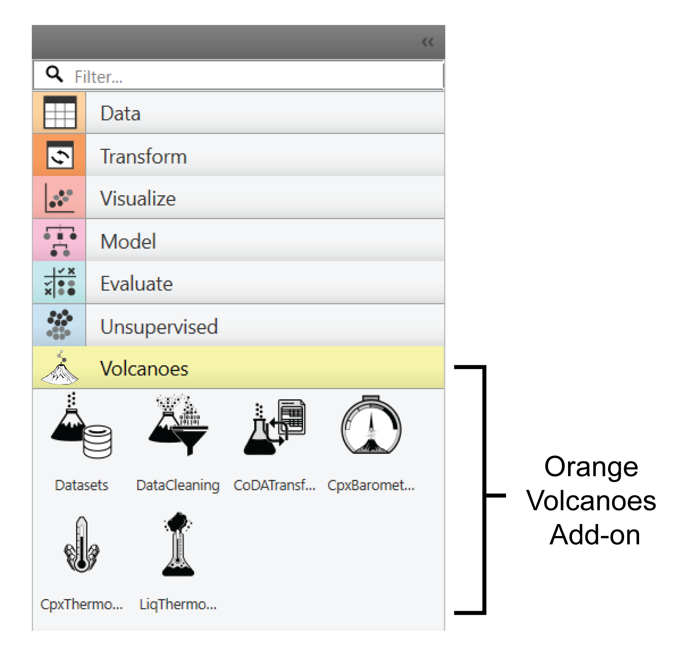

Introduction and Citation
=========================

Welcome to Orange-Volcanoes – Orange-Volcanoes is an extension (add-on) of the open-source
`Orange data mining platform <https://orangedatamining.com/>`_, specifically designed to support
data-driven investigations in petrology and volcanology. Through the integration of tools for
geochemical analysis into the Orange visual programming environment, Orange-Volcanoes allows
researchers to explore, visualize, and interpret complex datasets without a coding background.

This add-on enhances the basic functionality of Orange by introducing specialized widgets designed
for the specific needs of petrologists and volcanologists. These widgets facilitate geochemical data
workflows, enabling tasks such as:

- Importing and preparing petrological datasets
- Conducting compositional data analysis (CoDA)
- Cleaning and filtering geochemical analyses of glass and volcanic minerals
- Testing mineral-liquid equilibrium
- Performing thermobarometric calculations, both classical and machine learning-based.

The list of Orange-Volcanoes Add-ons is displayed in **Figure 1**.

   **Figure 1**. Orange-Volcanoes incorporates 6 dedicated widgets:
   1. **Datasets**: to upload existing open source volcanological, geochemical, and petrological datasets;
   2. **Data Cleaning**: to filter out bad data and observations at disequilibrium from the starting dataset;
   3. **CoDATransformation**: to apply a set of log-ratio transformations to geochemical datasets;
   4, 5, and 6. **Thermobarometers**: to perform classic and ML-based thermobarometric calculations on the analyzed dataset.

Orange-Volcanoes bridges the gap between advanced data science techniques and the specific requirements
of geochemical datasets. It uses Orange's powerful interactive environment to apply machine learning,
statistical modelling, and explainable AI methods to petrological datasets. Users can easily build
customized workflows by linking widgets, facilitating rapid iteration and discovery in magmatic and
volcanic research.

Whether you are conducting large-scale geochemical studies, refining glass and mineral chemical datasets,
or testing magmatic equilibria, Orange-Volcanoes offers an intuitive and flexible tool to enhance your
analytical capabilities. This documentation will guide you through each widget and its applications,
providing the basis for an in-depth study of volcanic and petrological processes.

Orange-Volcanoes is published in XXX:

**Link to the paper here**

Please cite the paper (DOI: XXX) if you are applying Orange-Volcanoes for your study.

Orange-Volcanoes is actively maintained and improved. We value user input for feature requests and bug
reports. To contribute, you can either submit a request or report an issue directly on the GitHub Issues
page, or reach out via email at XXX.

Are you interested in developing, expanding, or suggesting changes in Orange Volcanoes?
To contribute, you can either `submit a request`_ or `report an issue`_ directly on the `GitHub`_,
by using the dedicated `pull request`_ and `issues`_ spaces.

.. _submit a request: https://github.com/AIVolcanoLab/orange3-volcanoes/pulls
.. _report an issue: https://github.com/AIVolcanoLab/orange3-volcanoes/issues
.. _pull request: https://github.com/AIVolcanoLab/orange3-volcanoes/pulls
.. _issues: https://github.com/AIVolcanoLab/orange3-volcanoes/issues
.. _GitHub: https://github.com/AIVolcanoLab/orange3-volcanoes

