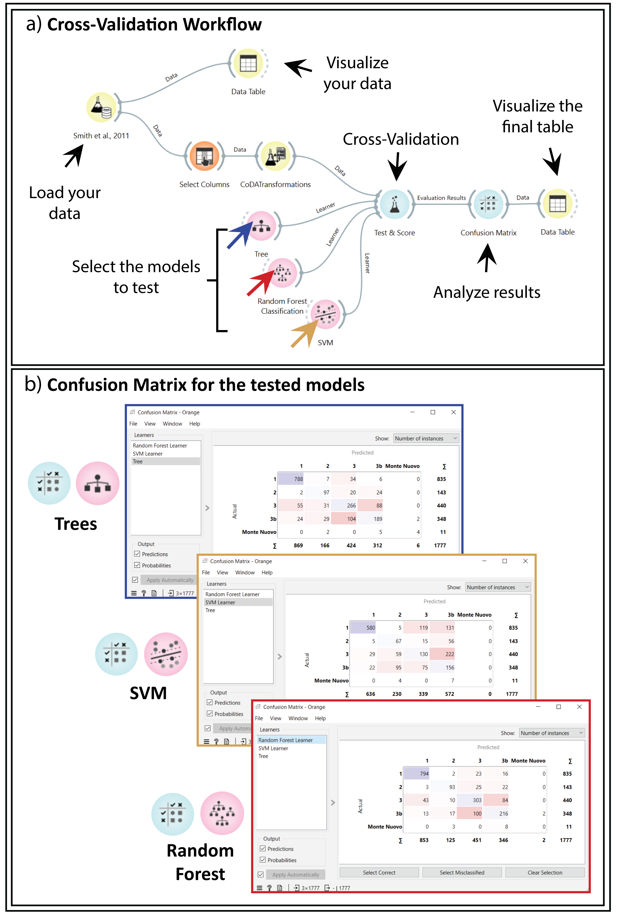

Tephra Classification
=====================

   Cross validation of multiple classification models.  
   Methods: Tree, Support Vector Machine (SVM), and Random Forest.  
   a) Cross validation workflow; b) Confusion Matrix.

Orange lets you test and compare classification models.  
You can cross-validate several models on the same dataset.  
This example shows a workflow for testing classification methods.

The dataset contains glass chemical analyses from Campi Flegrei.  
Data comes from Smith et al. (2011).  
We classify glasses by epoch based on their chemical composition.

We use three methods:
- Trees
- Random Forest
- Support Vector Machine (SVM)

The workflow tests all three methods at once.  
A confusion matrix visualizes the results.  
This makes it easy to analyze model performance.

Cross-validating multiple models is fast and interactive.  
It gives you control over model performance and scores.  
The process is simple and intuitive.

Connect the dataset and model with the "Test and Score" widget.  
Other evaluation widgets are available, such as:
- Confusion Matrix
- Performance Curve

These can be linked to score results and visualizations like scatterplots.
