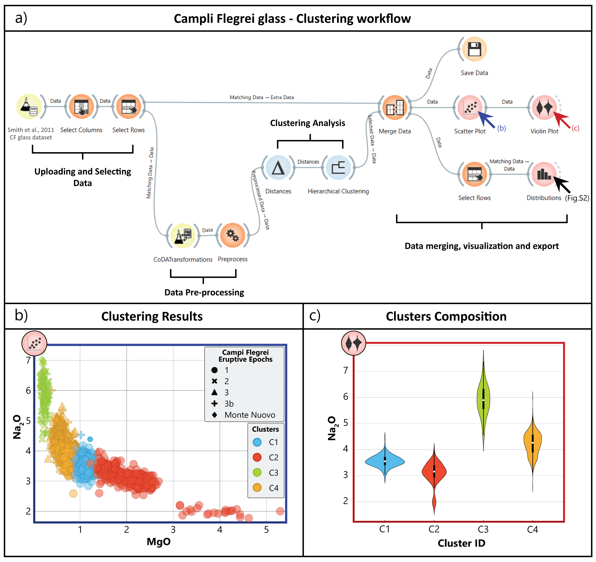

Tephra Clustering
=================

Here we show how to define a reproducible Machine Learning workflowuse on natural volcanic data.  
The data set consists of glass chemical analyses belonging the the recent activity of the Campi Flegrei caldera (Smith et al., 2011).

   Hierarchical Clustering on Campi Flegrei samples.  
   a) The workflow is divided into four steps: uploading, pre-processing, clustering, and merging/visualization/export.  

The workflow has four steps:

1. **Uploading and Selecting Data**  
   The data set is loaded.  
   Only the needed columns (e.g., major element compositions) are selected using the "Select Column" widget.  
   Rows with zeros or missing values are removed with the "Select Row" widget.

2. **Data Pre-processing**  
   The major element compositions are transformed with an isometric log-ratio (ilr) transformation.  
   This uses the "CoDATransformations" widget in Orange-Volcanoes.  
   The transformed data is normalized with a standard scaler in the "Preprocess" widget.  
   The ilr transformation lets you cluster geochemical data in Orange.

3. **Clustering Analysis**  
   The cleaned data is used for clustering.  
   Euclidean distances are computed with the "Distances" widget.  
   Hierarchical clustering is performed with the "Hierarchical Clustering" widget.  
   Other methods like k-means and Louvain Clustering are also available.

4. **Data Merging, Visualization, and Export**  
   The original data is merged with the transformed data and clustering results.  
   The clusters are shown with simple binary chemical scatterplots.  
   Extra plots explore cluster compositions and eruptive products.  
   The merged data set can be exported using the "Save Data" widget.

Four distinct clusters are identified by Euclidean distances.  
Most products from the first epoch are in Clusters 1 and 2.  
Cluster 3 dominates in the second epoch and later period.  
Cluster 4 mostly shows products from the third epoch with some from the first.  
An example plot shows Na₂O composition for three clusters.

This exercise shows that Orange and Orange-Volcanoes work well with geochemical data.  
The workflow is intuitive and user-friendly.  
Users can control the chemical meaning of the clusters.  
They can test different transformations, normalizations, and clustering methods interactively.
